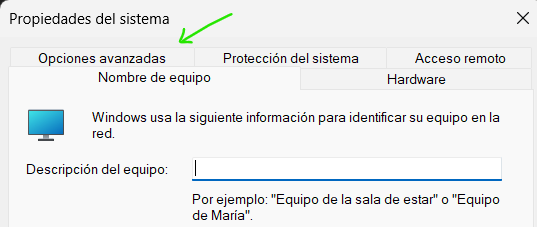
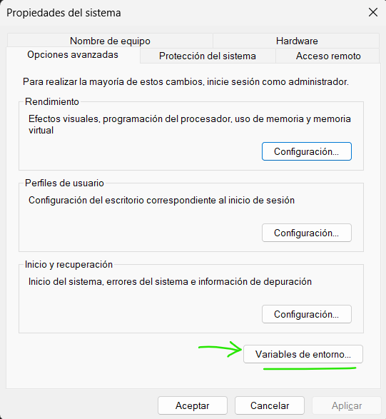
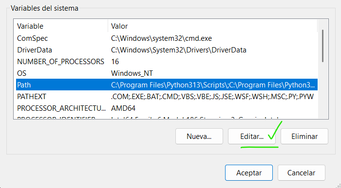
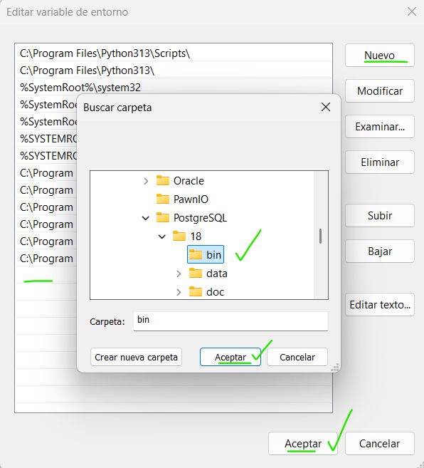
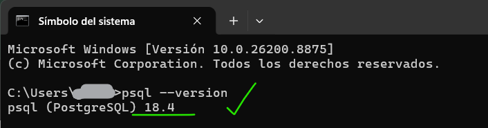
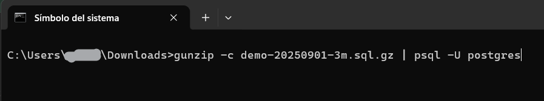
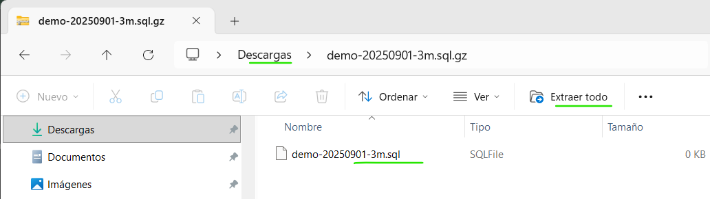
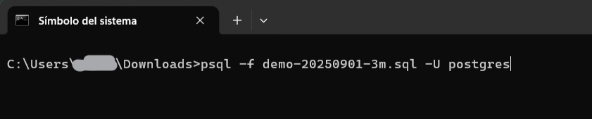
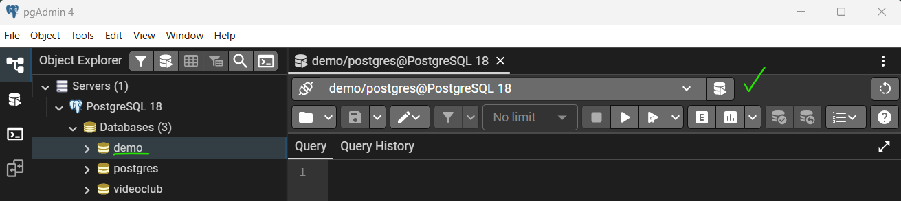

# Instalación de la Base de Datos "Airlines"

> **Observación:** Para realizar este proyecto, debéis tener previamente instalado `postgreSQL`/`pgAdmin 4` en tu sistema, sin embargo, si no lo tienes, haz clic en el siguiente enlace para descargar e instalar este gestor en tu sistema:
>
> [Cómo Descargar e Instalar PostgreSQL y pgAdmin 4 en Windows 11/10 Paso a Paso](https://youtu.be/ciJVekNidls?si=1qwxJE0m6XtMmXZE)

## Sugerencia de instalación de la BBDD

Pasos previos para la instalación correcta del fichero descargado `demo-20250901-3m.sql.gz`

### Paso 1: Verificación y Edición del `Path` de postgres

1. Presiona las teclas `Windows` + `R` en tu teclado para abrir la ventana “Ejecutar”.
2. Escribe `cmd` (Símbolo de Sistema) y presiona “Enter”.
3. En la ventana del terminal, escribe: `psql --version` y “Enter”.
4. Si el mensaje que ves indica “**que no lo reconoce …** “, es porque hace falta asociar el `Path` a las variables del sistema.

Entonces, sigue estos pasos para la “**Edición**” del `Path`.

1. Presiona las teclas `Windows` + `R` en tu teclado para abrir la ventana “**Ejecutar**”.
2. Escribe o pega exactamente este comando: `sysdm.cpl` y presiona “**Enter**”.
3. En la ventana que se abre, ve a la pestaña `Opciones avanzadas`

    

4. Haz clic abajo en el botón `Variables de entorno...`

    

5. Selecciona `Path` en las `variables del sistema` y haz clic en `Editar`.

    

6. Luego, elegimos “**Nuevo**” (vamos a agregar) y buscamos la carpeta “**bin**” de nuestro **postgreSQL** instalado, que por lo general se encuentra en la ruta `C:\Program Files\PostgreSQL\18\bin`, la seleccionamos y clic en “**Aceptar**”.

    

7. Luego seguimos haciendo clic en “**Aceptar**”, “**Aceptar**” y “**Aceptar**” en todas las demás ventanas hasta salir.
8. Finalmente repetiremos los primeros pasos anteriores de verificación.
    1. Presiona las teclas `Windows` + `R` en tu teclado para abrir la ventana “Ejecutar”.
    2. Escribe `cmd` (Símbolo de Sistema) y presiona “Enter”.
    3. En la ventana del terminal, escribe: `psql --version` y “Enter”.
    4. Debería verse en pantalla, algo así:

        

### Paso 2: `instalar`/`importar` fichero `.sql`

> **Observación:** Al descargar el archivo `.sql.gz`, este se encuentra “comprimido”. El `.gz` nos indica que utiliza la tecnología **Gzip** (GNU zip) y sirve para reducir el tamaño de un archivo individual y ahorrar espacio en el disco o acelerar su transferencia en internet.

Pues bien, tenemos dos caminos para “`instalar`/`importar`” la **Base de Datos** a nuestro **postgreSQL**:

1. **Sin extracción:** De forma directa, en la ventana de “Símbolo de Sistema” (terminal), nos vamos a dirigir a la carpeta de “Descargas” y escribiremos **exactamente** la siguiente línea de comando:

    

2. **Con extracción:** Primero debéis abrir el archivo `.gz` que se encuentra en “Descargas” y **extraer** el archivo `.sql` ubicándolo en la carpeta que desees, se recomienda usar la misma carpeta de “Descargas”.

    

    Luego, para `instalar`/`importar`, tenéis que abrir un terminal y ejecutar la siguiente línea de comando:

    

    Verificando que el nombre sea **exactamente el mismo** del fichero `.sql` que os hayáis descargado.

> **NOTA:** Puede que te pida que ingreses la contraseña de postgres.

Ahora solo queda esperar pacientemente un par de minutos a que termine de `instalar`/`importar` la BBDD y listo! 🥳🎉

### Paso 3: Ejecutar `postgreSQL`/`pgAdmin 4` y cargar la BBDD

Finalmente, abrimos nuestro `pgAdmin 4`,  buscamos la Base de Datos “**demo**”, y haciendo **clic derecho** sobre él, elegimos “**Query Tool**” para comenzar a realizar nuestras consultas.

Ahora que ya tenemos todo preparado, comencemos con el desarrollo del proyecto, ¡Vamos, tu puedes! 🫵😎✨

