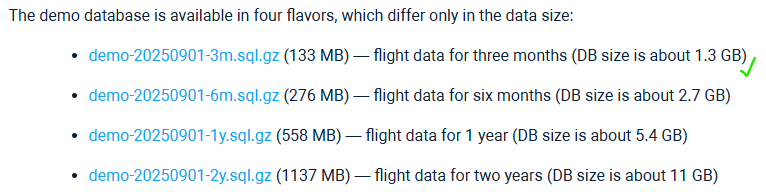
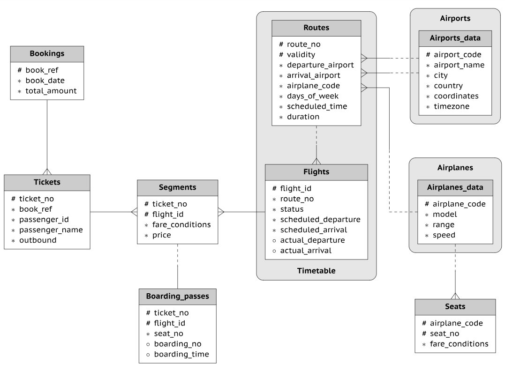
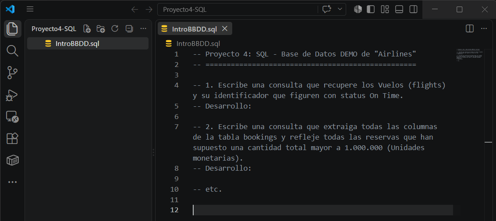

# Indicaciones para el Proyecto 4

## SQL - Consultas en `Demo Database Airlines`

Ahora te toca a ti poner en práctica lo aprendido. Sobre la misma base de datos que hemos instalado anteriormente en el curso, te proponemos que realices distintas operaciones de **lectura/consulta** para extraer datos.

Te dejamos la URL en la que puedes descargar la base de datos para instalarla y realizar los ejercicios planteados (descargad la versión más ligera si queréis).

[https://postgrespro.com/docs/postgrespro/current/demodb-bookings-installation.html](https://postgrespro.com/docs/postgrespro/current/demodb-bookings-installation.html)

### **Bookings Schema Diagram** (Diagrama esquemático de reservas)

---

## Para realizar la entrega

- Abre `VSCode` en la carpeta donde tengas tu repositorio GitHub y crea un fichero "**IntroBBDD.sql**"
- Según vayas completando los ejercicios en `PostgreSQL`, ve copiando las sentencias en el fichero en `VSCode`.

Tal y como se muestra en la siguiente imagen de ejemplo:

---

## Consultas SQL `obligatorias para el proyecto`

### 1. Escribe una consulta que recupere los Vuelos (flights) y su identificador que figuren con status On Time

### 2. Escribe una consulta que extraiga todas las columnas de la tabla bookings y refleje todas las reservas que han supuesto una cantidad total mayor a 1.000.000 (Unidades monetarias)

> **Nota:** las tablas son públicas de `Rusia`, por tanto son `Rublos` sus **unidades monetarias**

### 3. Escribe una consulta que extraiga todas las columnas de los datos de los modelos de aviones disponibles (aircraft_data). Puede que os aparezca en alguna actualización como "aircrafts_data", revisad las tablas y elegid la que corresponda

### 4. Con el resultado anterior visualizado previamente, escribe una consulta que extraiga los identificadores de vuelo que han volado con un Boeing 737. (Código Modelo Avión = 733)

### 5. Escribe una consulta que te muestre la información detallada de los tickets que han comprado las personas que se llaman Irina

> A partir de aquí son `QUERIES OPCIONALES` para continuar practicando:

### 6. Mostrar las ciudades con más de un aeropuerto

### 7. Mostrar el número de vuelos por modelo de avión

### 8. Reservas con más de un billete (varios pasajeros)

### 9. Vuelos con retraso de salida superior a una hora

Cuando hayas completado los ejercicios, haz `commit` en tu repositorio (público) para subir los cambios y poder compartirlos. Con tener un archivo con todas las `queries` estaría correcto.

Este proyecto es bastante **autocorregible**, por lo que aseguraos que el resultado es lo que se os pide antes de añadir la query al fichero.

Una vez terminado, tendréis que enviar el proyecto a `antonio.rosales@thepower.education` con el asunto **Proyecto 4: SQL - Vuestro nombre** y en el cuerpo del correo el **link** de tu **repositorio de GitHub**.

> 💡 A continuación os dejamos una [guía de instalación](/Instalacion-BBDD-Airlines.md). 👈

---

## Resumen del Proyecto 4: Ejercicios Prácticos de SQL (PostgreSQL)

Este repositorio contiene la resolución paso a paso de una serie de ejercicios prácticos de consulta en SQL utilizando una base de datos (DEMO) sobre vuelos, rutas y reservas.

### Conceptos aplicados

- **Unión de Múltiples Tablas (`JOIN`)**: Conexión secuencial de 2 y 3 tablas (`Flights` ➔ `Routes` ➔ `Airplanes_data`) mediante claves primarias y foráneas (`route_no`, `airplane_code`).
- **Agregación de Datos (`GROUP BY` / `COUNT`)**: Agrupación de registros para realizar conteos globales y específicos (por ejemplo, vuelos por modelo de avión o billetes por reserva).
- **Filtrado Condicional (`WHERE` vs `HAVING`)**:
  - Uso `WHERE` para filtrar filas individuales antes de agrupar.
  - Uso `HAVING` para aplicar condiciones sobre datos ya agrupados.
- **Ordenamiento (`ORDER BY`)**: Clasificación de resultados en orden descendente (`DESC`).
- **Manejo de Tiempos y Fechas (`INTERVAL`)**: Operaciones aritméticas entre marcas de tiempo para calcular retrasos y filtrar por rangos específicos (ej. `INTERVAL '1 hour'`).
